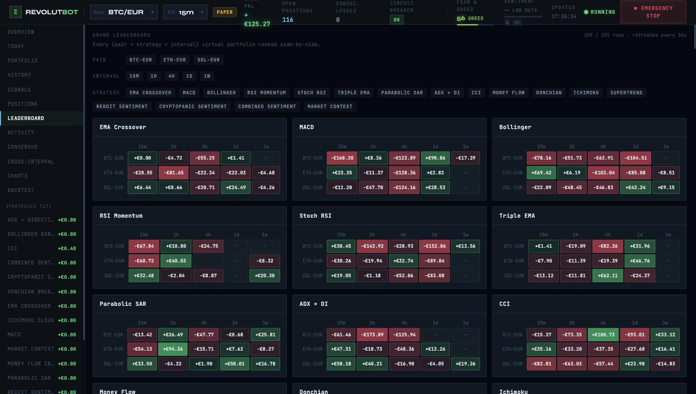

# Revolut X Trading Bot

[](./LICENSE)

An automated cryptocurrency trading system that runs **17 independent strategies** — 13 technical-analysis, 3 sentiment-based, and 1 macro market-context — across **3 pairs** and **5 candle intervals** simultaneously, on a 30-second heartbeat.

Every `(pair, strategy, interval)` combination is treated as its own isolated virtual portfolio: independent positions, trades, risk state, and P&L tracking, with balance shared per `(pair, strategy)` across intervals. That works out to **255 concurrent paper-trading portfolios** running side by side, all evaluated live against real market data, so strategies can be compared apples-to-apples under identical conditions.

Built to answer a simple question: *which trading strategy actually works, on which asset, on which timeframe — with real numbers, not guesswork.*


*The Grand Leaderboard: all 255 virtual portfolios, ranked live. Green = net-profitable, red = net-losing — most of the grid is red, which is the point (see [Results](#results)).*

---

## Results

The bot has been paper-trading continuously since **2026-04-14** (~157 days as of this writing), producing **14,400+ closed trades** across the active strategy matrix. Here's the honest answer to "does any of this actually work":

- **45 of the 198 triples that have traded so far (23%) are net-profitable** after fees and slippage.
- **System-wide, the cumulative result is gross −€5,668 / net −€14,502.** Running 198 strategy/pair/interval combinations in parallel does not average out to a winning system — it mostly demonstrates how much cost drag matters at this position size.
- Average simulated fee + slippage cost is **~€0.61 per closed trade**, while most strategies' gross edge per trade sits in the €0.05–€0.15 range. That gap — not bad signal quality — is the main reason strategies lose money net of costs; several triples have 55–70% win rates and are still net losers.
- The best performers with a real sample size (≥20 trades, to filter out small-sample noise):

| Pair | Strategy | Interval | Trades | Gross P&L | Net P&L | Win rate (net) |
|---|---|---|---|---|---|---|
| BTC-EUR | CCI | 4h | 67 | +€100.73 | +€41.47 | 61.2% |
| SOL-EUR | TRIPLE_EMA | 4h | 68 | +€62.11 | +€40.65 | 27.9% |
| SOL-EUR | ICHIMOKU | 1h | 32 | +€46.62 | +€37.59 | 40.6% |
| ETH-EUR | RSI_MOMENTUM | 1h | 21 | +€40.03 | +€32.29 | 85.7% |
| ETH-EUR | PARABOLIC_SAR | 1h | 166 | +€94.36 | +€29.32 | 33.1% |

Take that table with appropriate skepticism — see [Core concepts](#core-concepts) below for why picking winners out of 255 parallel strategies isn't the same as finding an edge. This kind of data has already been used to prune 16 of the worst-bleeding triples (a data-driven cut, documented in `BACKTESTING.md`), and the single most rigorously tested triple — `BTC-EUR / RSI_MOMENTUM / 1h`, 6-month walk-forward — turned out to be **regime-dependent**: profitable in ranging markets, a net loser in trending ones, −€28 overall. That's the project's actual headline finding: *most of these strategies don't clear Revolut's cost structure, and the ones that look good in a short window need walk-forward validation before anyone should trust them.*

Full methodology, per-strategy findings, and the ongoing experiment log live in [`BACKTESTING.md`](./BACKTESTING.md).

---

## Why this exists

Most "trading bot" projects pick one strategy and hope. This one flips that around: it runs a large, diverse basket of strategies against the same live data at the same time, tracks fee- and slippage-adjusted P&L for each in complete isolation, and lets the data show which combinations of `(pair, strategy, interval)` are actually worth trusting — before any real money is ever involved.

It's currently in **PAPER trading mode only**. No live orders are placed. Every fill is simulated, but with realistic cost modelling (taker fees + slippage on both entry and exit), so the numbers reflect what would actually happen, not an idealized backtest.

---

## What it does

- **Runs 17 strategies in parallel** — 13 technical-analysis (EMA Crossover, MACD, Bollinger Bands, RSI Momentum, Stochastic RSI, Triple EMA, Parabolic SAR, ADX+DI, CCI, MFI, Donchian Breakout, Ichimoku Cloud, Supertrend), 3 sentiment-driven (Reddit, CryptoPanic, and a combined/agreement-filtered blend), and 1 macro strategy that trades contrarian against the Fear & Greed Index, confirmed by order-book imbalance.
- **Across 3 pairs** — BTC-EUR, ETH-EUR, SOL-EUR — **and 5 timeframes** — 15m, 1h, 4h, 1d, 1w — every strategy is evaluated on every pair at every interval, independently.
- **Isolates risk per portfolio** — each `(pair, strategy, interval)` triple has its own take-profit/stop-loss management, position sizing limits, daily-loss circuit breaker, and consecutive-loss circuit breaker, so one bad strategy can never bleed into another's numbers.
- **Models real trading costs** — every simulated trade accounts for taker fees and slippage on both the entry and exit leg, and every P&L figure is reported both gross and net so fee drag is never hidden.
- **Backtests against history** — a deterministic backtest engine replays the *exact* live strategy code bar-by-bar over stored historical candles (not a separate reimplementation), including walk-forward validation across multiple sub-windows to catch strategies that only got lucky on one slice of history.
- **Layers in sentiment and macro context** — a self-hosted Python scraper collects Reddit and CryptoPanic posts, classifies them, and feeds windowed sentiment scores into three dedicated sentiment strategies; a Fear & Greed + order-book service feeds the macro strategy. Both pipelines are opt-in and budget-capped.
- **Notifies in real time** — Telegram alerts on position open/close, circuit-breaker trips, and a scheduled daily summary.
- **Visualizes everything** — a full React dashboard for comparing strategies side by side, drilling into per-trade forensic history, watching live positions and signals across the entire strategy matrix, and ranking every triple on a leaderboard.

---

## How it works

```
  Revolut X API              Sentiment Scraper
  (live market data)         (Reddit + CryptoPanic, Python)
          │                           │
          └─────────────┬─────────────┘
                         ▼
          Trading Engine (Java / Spring Boot)
          30s heartbeat → evaluate 17 strategies
          × 3 pairs × 5 intervals → per-triple risk
          checks → simulate fill (fee + slippage)
                         │
                         ▼
                   PostgreSQL 16
        (positions · trades · signals · backtests)
                         │
             ┌───────────┴───────────┐
             ▼                       ▼
     REST API (Spring)        Telegram Alerts
     30+ endpoints        (trades, circuit breakers,
             │                  daily summary)
             ▼
     React Dashboard
     (strategy compare, leaderboard,
      trade forensics, live signals)
```

Every 30 seconds, the trading loop fetches candles once per `(pair, interval)` pair (shared across all strategies to avoid redundant API calls), evaluates all 17 strategies against that data, checks each triple's risk constraints independently, and simulates a fill — complete with fee and slippage costs — whenever a strategy signals BUY or SELL.

---

## Tech stack

| Layer | Technology |
|---|---|
| **Backend** | Java 21, Spring Boot, Maven, Ta4j (technical indicators), BouncyCastle (Ed25519 request signing), OkHttp |
| **Database** | PostgreSQL 16, Flyway migrations |
| **Frontend** | React 19, TypeScript, Vite, TanStack Query, Recharts, Tailwind CSS, shadcn/ui |
| **Sentiment pipeline** | Python 3.12 microservice — scrapes Reddit + CryptoPanic, classifies with an LLM, pushes batched results to the backend |
| **Testing** | Spock + Groovy |
| **Notifications** | Telegram Bot API |
| **Infra** | Self-hosted VPS, systemd services, nginx |

---

## Core concepts

**The execution unit is the triple.** `(pair, strategy, interval)` — e.g. `(BTC-EUR, MACD, 4h)` — is the atomic unit of the whole system. Each triple has its own signal history, positions, trades, and risk state, completely independent of every other triple. Balances are shared per `(pair, strategy)` across intervals; everything else is fully isolated.

**Costs are modelled, not ignored.** Every simulated trade pays a taker fee and incurs slippage on both entry and exit. `net_pnl` (what you'd actually keep) is always reported alongside gross P&L, so a strategy that looks profitable before costs but loses to fee drag is easy to spot.

**Backtests run the real code.** The backtest engine doesn't reimplement strategy logic separately — it replays historical candles through the same `TradingStrategy` implementations used live, applying the same cost model, so backtest results are directly comparable to paper-trading results. Walk-forward mode splits a date range into consecutive windows and produces a pass/fail verdict, surfacing strategies that only performed well on a lucky slice of history.

**Sentiment is opt-in and budget-capped.** The three sentiment strategies (Reddit, CryptoPanic, and a combined/agreement-filtered blend) are disabled by default. When enabled, LLM classification spend is hard-capped at a small monthly budget, with persistent tracking that survives restarts.

**255 parallel strategies means chance winners are expected.** Running that many `(pair, strategy, interval)` combinations at once guarantees a handful will look profitable from pure variance, even with zero real edge. Walk-forward validation — testing a strategy across multiple consecutive out-of-sample windows instead of trusting one lucky period — is what's used to tell a real edge from noise; the [Results](#results) section above shows why that distinction matters in practice.

---

## Dashboard highlights

- **Overview** — all strategies for a selected pair + interval, side by side
- **Leaderboard** — every triple ranked by P&L, win rate, and expectancy, with a pair × interval heatmap per strategy
- **History** — forensic per-trade analytics: equity curve, drawdown, exit-reason breakdown, R-multiple distribution, day × hour heatmap, streak timeline
- **Live Positions** — every open position across all 255 triples with live unrealised P&L and TP/SL progress
- **Signals** — the full strategy matrix's latest signal, with reason, confidence, and indicator values
- **Consensus** — aggregates all strategies' current signals per `(pair, interval)` into a confidence-weighted BUY/SELL/HOLD score
- **Cross-Interval** — compares one `(pair, strategy)` across all 5 timeframes side by side
- **Today** — a single-page daily digest: KPIs, per-strategy breakdown, closed trades, positions opened today
- **Activity** — a full audit trail of bot lifecycle events

---

## Getting started

**Requirements:** Java 21, Maven, Node.js, PostgreSQL 16 (Docker recommended)

```bash
# 1. Start PostgreSQL (Docker)
docker run -d --name trading-bot-db \
  -e POSTGRES_DB=trading_bot \
  -e POSTGRES_USER=trading_bot \
  -e POSTGRES_PASSWORD=secret \
  -p 5432:5432 postgres:16

# 2. Start the backend (Flyway migrations run automatically)
cd revolut-trading-bot
mvn spring-boot:run -Dspring-boot.run.profiles=local
# → http://localhost:8089

# 3. Start the frontend (separate repo — github.com/Ogstef/revolut-bot-ui)
git clone git@github.com:Ogstef/revolut-bot-ui.git && cd revolut-bot-ui
npm install && npm run dev
# → http://localhost:5173
```

The engine runs in **PAPER mode** — a Revolut X API key (Ed25519-signed) is still needed to pull live market data, but no orders are ever placed against the real account.

---

## Project structure

This repository holds the backend and project docs. The dashboard and the sentiment scraper are separate repos, listed below.

```
revolut-trading-bot-X/
├── revolut-trading-bot/       # Java 21 / Spring Boot backend — trading engine, REST API, risk management
├── docs/
│   └── future-plans/          # Specs for unbuilt features (backtest engine v2, risk analytics, etc.)
├── API_CONTRACT.md            # Canonical HTTP contract for all /api/** endpoints
├── BACKTESTING.md             # Backtest engine architecture + strategy tuning log
└── CLAUDE.md                  # Project instructions used by Claude Code while building this
```

| Repo | Contents |
|---|---|
| [`revolut-trading-bot-X`](.) (this repo) | Java backend, docs |
| [`revolut-bot-ui`](https://github.com/Ogstef/revolut-bot-ui) | React 19 / TypeScript dashboard |
| [`reddit-crypto-scraper`](https://github.com/Ogstef/reddit-crypto-scraper) | Python sentiment scraper microservice |

---

## Known limitations

- **Fee drag is unsolved, not just documented.** Most strategies have a real (if modest) directional edge, but at the current position size, Revolut's 0.09% taker fee + 0.05% slippage per side (0.28% round-trip) eats it. Fixing this needs larger position sizing, coarser intervals, or a regime filter — none of which has been tested at scale yet.
- **Only a handful of the 198 active triples have been rigorously walk-forward validated.** Most "cut list" and "best performer" calls in this README and `BACKTESTING.md` are single-window observations or data-driven heuristics, not proven edges. Treat anything without an explicit walk-forward verdict as unvalidated.
- **No live order execution path exists.** The bot is PAPER-only, end to end. Going live would require a separate build — Ed25519-signed order placement, position reconciliation against the real account, and considerably more testing — before it should touch real money.

---

## Status

**Currently in PAPER trading mode.** All fills are simulated with realistic fee and slippage modelling — no live orders are placed. The project includes a deterministic backtest engine (with walk-forward validation) used to evaluate strategies against historical data before any are considered for live trading.

---

## Disclaimer

This is a personal research and engineering project. Nothing here is financial advice, and past or simulated performance is not indicative of future results. The system is not currently placing live orders.
